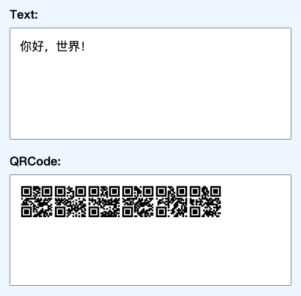

# 二维码像素字体 / QRCode Pixel Font

将字符显示为二维码的字体。

这个项目提供了构建字体所需要的完整程序。

## 预览

## 程序依赖

- [Pixel Font Builder](https://github.com/TakWolf/pixel-font-builder)
- [Pixel Font Knife](https://github.com/TakWolf/pixel-font-knife)
- [Pure python QR Code generator](https://github.com/lincolnloop/python-qrcode)
- [tqdm](https://github.com/tqdm/tqdm)
- [Loguru](https://github.com/Delgan/loguru)
- [Cyclopts](https://github.com/BrianPugh/cyclopts)
- [Vue.js](https://cn.vuejs.org)

## 许可证

分为「字体」和「构建程序」两个部分。

### 字体

使用 [「SIL 开放字体许可证第 1.1 版」](LICENSE-OFL) 授权。

### 构建程序

使用 [「MIT 许可证」](LICENSE-MIT) 授权。

## 赞助

如果这个项目对您有帮助，请考虑赞助来支持开发工作。

请通过下面的链接来查看收到的赞助的具体情况：

[赞助详情](https://github.com/TakWolf/TakWolf/blob/master/sponsors.md)
